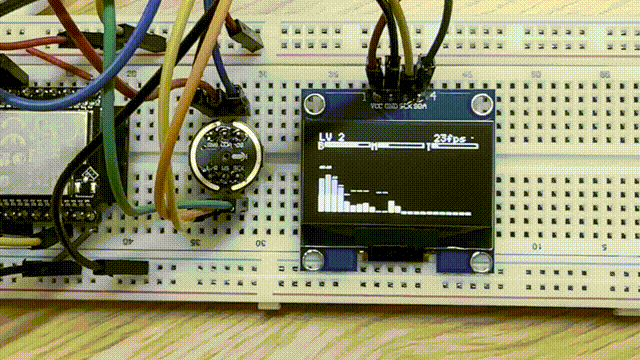

# Real-Time ESP32 Audio Visualizer

A compact, real-time audio spectrum visualizer on ESP32 using an INMP441 microphone and a 128x64 OLED display.

## Project Description

This project captures audio from an INMP441 digital MEMS microphone over I2S, performs FFT analysis on the ESP32, and renders a responsive spectrum on a 128x64 SH1106 OLED over I2C.

It is tuned to stay smooth and readable on a small monochrome display, while still reacting quickly to beats and transients.

## Tech Stack (and Why)

- ESP32 + Arduino framework (PlatformIO)
  - Reliable embedded toolchain and easy upload/monitor workflow.
- INMP441 microphone over I2S
  - Native digital audio stream with low CPU overhead compared to analog sampling.
- arduinoFFT
  - Efficient FFT implementation suitable for real-time spectral analysis on microcontrollers.
- U8g2
  - Mature, fast monochrome display library with good SH1106 support.
- FreeRTOS tasks (built into ESP32 Arduino core)
  - Separates audio capture and visualization to reduce jitter and keep frame timing predictable.

## Engineering Challenges

The ESP32 must capture audio continuously, process FFT frames, and update the display without visible stutter.

Key design choices:
- Dedicated tasks pinned to different cores:
  - `taskEar` on Core 0 for I2S capture
  - `taskEye` on Core 1 for FFT + rendering
- Single-frame queue overwrite strategy
  - Always processes the newest frame and avoids backlog growth.
- Fixed visual cadence (`vTaskDelayUntil`)
  - Keeps display updates stable even when input dynamics change.

## Quick Start

### Requirements
- VS Code with the PlatformIO IDE extension installed
- ESP32 NodeMCU-32S board
- INMP441 microphone module
- SH1106 128x64 I2C OLED (`0x3C`)

### Build and Upload

1. Open this project folder in VS Code.
2. In the PlatformIO sidebar, open **Project Tasks** for `nodemcu-32s`.
3. Run **Build** to compile the firmware.
4. Connect the ESP32 board over USB, then run **Upload**.
5. Open **Monitor** in PlatformIO to view serial logs at `115200` baud.

### Wiring Guide

#### INMP441 -> ESP32 (I2S)

- `VDD` -> `3V3`
- `GND` -> `GND`
- `SCK` -> `GPIO32`
- `WS` -> `GPIO25`
- `SD` -> `GPIO33`
- `L/R` -> `GND` (left channel)

#### SH1106 OLED -> ESP32 (I2C)

- `VCC` -> `3V3`
- `GND` -> `GND`
- `SCL` -> `GPIO22`
- `SDA` -> `GPIO21`

